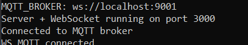
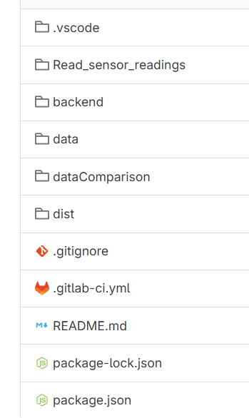

#  Plant Monitoring System

##  Purpose and Benefits

This project aims to monitor plant conditions using smart sensors. The system continuously tracks temperature, light levels, soil moisture, water levels, and humidity to help plant owners take better care of their plants.

###  Benefits:
- Prevents over or under watering
- Warns if the light exposure is too high or too low
- Monitors and displays real time data recieved from the sensors. (humidity, temperature, light, water and moisture)
- Easy to use GUI with historical data

---

##  Hardware & Software Architecture

###  Hardware
- **Wio Terminal**
- **Wio Terminal Battery Chassis**
- **Grove Sensors:**
  - DHT11 for temperature and humidity
  - Soil moisture sensor
  - Light sensor
  - Water sensor

### Software
- **Arduino (C++)** on Wio Terminal
- **Mosquitto MQTT Broker** (running on local network)
- **Vue.js Frontend** (displays live sensor data)
- **MySQL** (stores sensor history)
- **CI/CD pipeline** via GitLab for Arduino builds

>  *Architecture Diagram:*  
[

---

##  How to Set Up and Run

###  Requirements
- Arduino IDE with **PubSubClient** and **DHT** libraries
- Docker + Mosquitto (with WebSocket configured)
- Node.js + Vue CLI 

---

###  Arduino Setup
1. Open Arduino IDE
2. Install libraries:
    - Select Tools>Manage libraries 
    - Search up and install:
        "PubSubClient"
        "rpcWifi"
        "DHT"
        “ArduinoJson"
3. Include libraries:
    - Manage Libraries>Include Libraries
    - Search and select:
        "PubSubClient"
        "rpcWifi"
        "DHT"
        “ArduinoJson"
4. Upload code to Wio Terminal
5. Ensure WiFi credentials and MQTT broker IP are correctly configured

---

### Database (mySQL)

1. Install mySQL: https://dev.mysql.com/downloads/installer/

2. In terminal type: mysql -u root -p.
3. When prompted to enter a password, simply press enter.
4. type CREATE DATABASE plantdb;
5. USE plantdb;
6. Now we need to connect to the rest of the code.
7. Start by finding the path to plantdb.sql in the repo.
8. Type: SOURCE C:your/path;

---


### Node modules
1. cd into project root.
2. type: npm i

3. cd into the data folder. 
4. type: npm i
5. type: npm install socket.io-client
6. type: npm install pinia

7. cd into backend folder.
8. type: npm i 
9. type: npm install socket.io

---

###  MQTT Broker (Mosquitto)
1. Edit "Mosquitto conf" to enable WebSocket:
    ```bash
    allow_anonymous true

    listener 1883
    protocol mqtt
   

    listener 9001
    protocol websockets

    ```
2. Run:

    ```bash
    mosquitto -c mosquitto.conf
    ```

---

###  Vue Frontend
1. Navigate to the data folder through terminal.
2. Make sure to have the necessary node modules installed.
3. Run:
    ```bash
    npm run dev
    ```
4. The Vue app will connect to MQTT over WebSocket

---

### Server 
1. Navigate to the backend folder through terminal.
2. Make sure to have the necessary node modules installed.
3. Run:
    ```
    node server.js
    ```
If everything is set up correctly you will see a message similar to:





### Repository structure 



Folders:
- backend: code that connects MQTT and the database with the frontend
- data: code for the frontend part of our system (Vue)

##  Team Contributions

| Name      | Contribution |
|-----------|--------------|
| **Tilly**     | Arduino programming, sensor integration, documentation |
| **Artemis**   | MQTT setup, CI/CD pipeline, Arduino programming |
| **Sanjana**   | Frontend development with Vue.js, data storage logic |
| **Tyra**      | MySQL integration, data storage logic, frontend development focused on integration with the database|
| **Giovanna**  | Project coordination, development with Vue.js, video editing |

##  Link to demo:


[Demo for plant monitoring system](https://youtu.be/WSujGwdSVv8)


---

